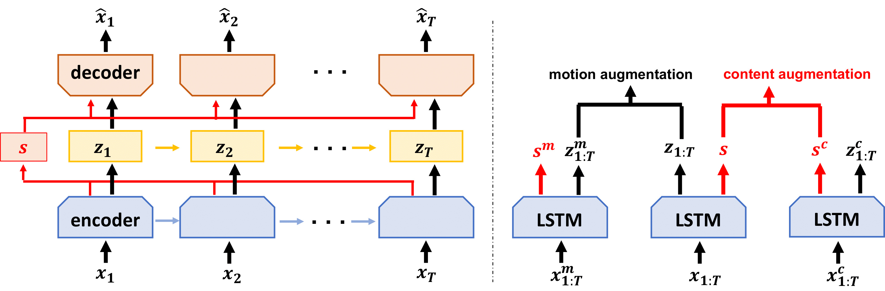

# Contrastively Disentangled Sequential Variational Autoencoder (C-DSVAE)

## Overview

<div align=center></div>

This is the implementation for our [C-DSVAE](https://arxiv.org/abs/2110.12091), a novel self-supervised disentangled sequential representation learning method.

A [pytorch-lightning](https://pytorch-lightning.readthedocs.io/en/stable/) implementation (with docker env) can be found [here](https://github.com/tomoya-yamanokuchi/Contrastively-Disentangled-Sequential-Variational-Audoencoder).

## Requirements
- Python 3
- PyTorch 1.7
- Numpy 1.18.5

## Dataset

#### Sprites

We provide the raw Sprites `.npy` [files](https://drive.google.com/drive/folders/1YphztSJNd3l9YTfr-Gh2Gvu4sNqydVkI?usp=sharing). One can also find the dataset on a third-party [repo](https://github.com/YingzhenLi/Sprites).

For each split (train/test), we expect the following components for each sequence sample
* `x`: raw sample of shape [8, 3, 64, 64]
* `c_aug`: content augmentation of shape [8, 3, 64, 64]
* `m_aug`: motion augmentation of shape [8, 3, 64, 64]
* motion factors: action (3 classes), direction (3 classes)
* content factors: skin, tops, pants, hair (each with 6 classes)

The pre-processed dataset: [data.pkl](https://drive.google.com/file/d/1PLaEmvn7xrA_rNPCUnWYJd-YQ3HW0EDo/view?usp=share_link)

## Running

#### Train

```
./run_cdsvae.sh
```

#### Test

```
./run_test_sprite.sh
```

#### Classification Judge

The *judge* classifiers are pretrained with full supervision separately. 
* Sprites [judge](https://drive.google.com/file/d/1leSUS1gz6erCZ12xFINDMhV_J0tYIVcf/view?usp=sharing)

#### C-DSVAE Checkpoints

We provide a sample Sprites [checkpoint](https://drive.google.com/file/d/1dRg6MNUqp5xBe9-CvTQln6DCvrTZMjDD/view?usp=sharing). Checkpoint parameters can be found in `./run_test_sprite.sh`.

## Paper

If you are inspired by our work, please cite the following paper:

```bibtex
@article{bai2021contrastively,
  title={Contrastively disentangled sequential variational autoencoder},
  author={Bai, Junwen and Wang, Weiran and Gomes, Carla P},
  journal={Advances in Neural Information Processing Systems},
  volume={34},
  pages={10105--10118},
  year={2021}
}
```
